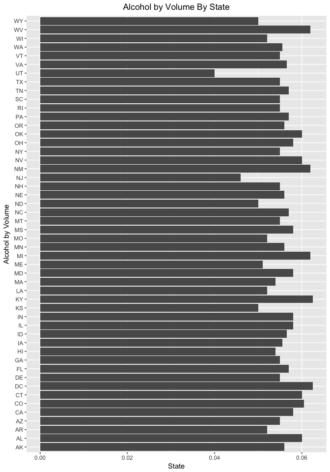
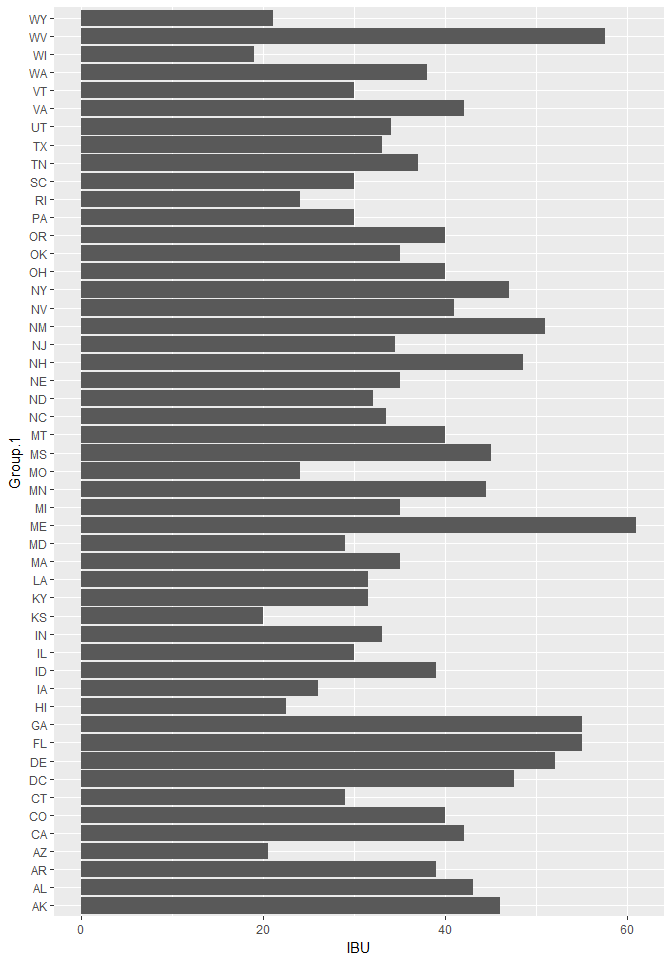
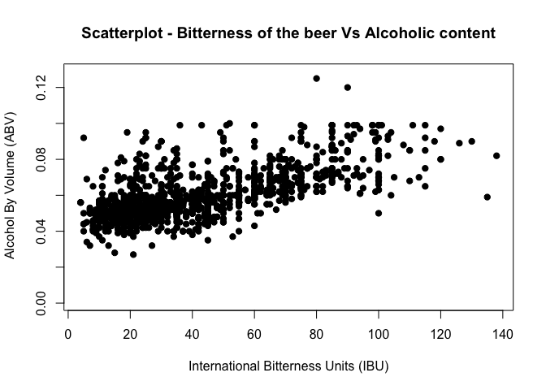

### MSDS 6306: Case Study 1 Introduction
The following document represents a case study of craft breweries and the beers they produce across the United States. In this study we will make some general observations with the hope of providing information concerning details of the craft brewery market in the United States. This study does not represent an exhaustive list of craft breweries and their beers, but does contain general information about the overall craft beer market.Craft breweries are growing across the nation, as we can see in the following table.

Table 1: Contains a total count of the number of breweries by their respective state

```r
# Question 1. How many breweries are present in each state?
# Read the breweries.csv into a dataframe and assign the variable name brew
brew <- read.csv(file = "breweries.csv", header = TRUE, sep = ",", strip.white = TRUE)
# Assign the count function against the State column to the variable name st
st <- count(brew, "State")
# Display the st variable output
kable( st,row.names=FALSE )  %>%
  kable_styling(bootstrap_options = c("striped", "condensed"), full_width = F)
```

<table class="table table-striped table-condensed" style="width: auto !important; margin-left: auto; margin-right: auto;">
 <thead>
  <tr>
   <th style="text-align:left;"> State </th>
   <th style="text-align:right;"> freq </th>
  </tr>
 </thead>
<tbody>
  <tr>
   <td style="text-align:left;"> AK </td>
   <td style="text-align:right;"> 7 </td>
  </tr>
  <tr>
   <td style="text-align:left;"> AL </td>
   <td style="text-align:right;"> 3 </td>
  </tr>
  <tr>
   <td style="text-align:left;"> AR </td>
   <td style="text-align:right;"> 2 </td>
  </tr>
  <tr>
   <td style="text-align:left;"> AZ </td>
   <td style="text-align:right;"> 11 </td>
  </tr>
  <tr>
   <td style="text-align:left;"> CA </td>
   <td style="text-align:right;"> 39 </td>
  </tr>
  <tr>
   <td style="text-align:left;"> CO </td>
   <td style="text-align:right;"> 47 </td>
  </tr>
  <tr>
   <td style="text-align:left;"> CT </td>
   <td style="text-align:right;"> 8 </td>
  </tr>
  <tr>
   <td style="text-align:left;"> DC </td>
   <td style="text-align:right;"> 1 </td>
  </tr>
  <tr>
   <td style="text-align:left;"> DE </td>
   <td style="text-align:right;"> 2 </td>
  </tr>
  <tr>
   <td style="text-align:left;"> FL </td>
   <td style="text-align:right;"> 15 </td>
  </tr>
  <tr>
   <td style="text-align:left;"> GA </td>
   <td style="text-align:right;"> 7 </td>
  </tr>
  <tr>
   <td style="text-align:left;"> HI </td>
   <td style="text-align:right;"> 4 </td>
  </tr>
  <tr>
   <td style="text-align:left;"> IA </td>
   <td style="text-align:right;"> 5 </td>
  </tr>
  <tr>
   <td style="text-align:left;"> ID </td>
   <td style="text-align:right;"> 5 </td>
  </tr>
  <tr>
   <td style="text-align:left;"> IL </td>
   <td style="text-align:right;"> 18 </td>
  </tr>
  <tr>
   <td style="text-align:left;"> IN </td>
   <td style="text-align:right;"> 22 </td>
  </tr>
  <tr>
   <td style="text-align:left;"> KS </td>
   <td style="text-align:right;"> 3 </td>
  </tr>
  <tr>
   <td style="text-align:left;"> KY </td>
   <td style="text-align:right;"> 4 </td>
  </tr>
  <tr>
   <td style="text-align:left;"> LA </td>
   <td style="text-align:right;"> 5 </td>
  </tr>
  <tr>
   <td style="text-align:left;"> MA </td>
   <td style="text-align:right;"> 23 </td>
  </tr>
  <tr>
   <td style="text-align:left;"> MD </td>
   <td style="text-align:right;"> 7 </td>
  </tr>
  <tr>
   <td style="text-align:left;"> ME </td>
   <td style="text-align:right;"> 9 </td>
  </tr>
  <tr>
   <td style="text-align:left;"> MI </td>
   <td style="text-align:right;"> 32 </td>
  </tr>
  <tr>
   <td style="text-align:left;"> MN </td>
   <td style="text-align:right;"> 12 </td>
  </tr>
  <tr>
   <td style="text-align:left;"> MO </td>
   <td style="text-align:right;"> 9 </td>
  </tr>
  <tr>
   <td style="text-align:left;"> MS </td>
   <td style="text-align:right;"> 2 </td>
  </tr>
  <tr>
   <td style="text-align:left;"> MT </td>
   <td style="text-align:right;"> 9 </td>
  </tr>
  <tr>
   <td style="text-align:left;"> NC </td>
   <td style="text-align:right;"> 19 </td>
  </tr>
  <tr>
   <td style="text-align:left;"> ND </td>
   <td style="text-align:right;"> 1 </td>
  </tr>
  <tr>
   <td style="text-align:left;"> NE </td>
   <td style="text-align:right;"> 5 </td>
  </tr>
  <tr>
   <td style="text-align:left;"> NH </td>
   <td style="text-align:right;"> 3 </td>
  </tr>
  <tr>
   <td style="text-align:left;"> NJ </td>
   <td style="text-align:right;"> 3 </td>
  </tr>
  <tr>
   <td style="text-align:left;"> NM </td>
   <td style="text-align:right;"> 4 </td>
  </tr>
  <tr>
   <td style="text-align:left;"> NV </td>
   <td style="text-align:right;"> 2 </td>
  </tr>
  <tr>
   <td style="text-align:left;"> NY </td>
   <td style="text-align:right;"> 16 </td>
  </tr>
  <tr>
   <td style="text-align:left;"> OH </td>
   <td style="text-align:right;"> 15 </td>
  </tr>
  <tr>
   <td style="text-align:left;"> OK </td>
   <td style="text-align:right;"> 6 </td>
  </tr>
  <tr>
   <td style="text-align:left;"> OR </td>
   <td style="text-align:right;"> 29 </td>
  </tr>
  <tr>
   <td style="text-align:left;"> PA </td>
   <td style="text-align:right;"> 25 </td>
  </tr>
  <tr>
   <td style="text-align:left;"> RI </td>
   <td style="text-align:right;"> 5 </td>
  </tr>
  <tr>
   <td style="text-align:left;"> SC </td>
   <td style="text-align:right;"> 4 </td>
  </tr>
  <tr>
   <td style="text-align:left;"> SD </td>
   <td style="text-align:right;"> 1 </td>
  </tr>
  <tr>
   <td style="text-align:left;"> TN </td>
   <td style="text-align:right;"> 3 </td>
  </tr>
  <tr>
   <td style="text-align:left;"> TX </td>
   <td style="text-align:right;"> 28 </td>
  </tr>
  <tr>
   <td style="text-align:left;"> UT </td>
   <td style="text-align:right;"> 4 </td>
  </tr>
  <tr>
   <td style="text-align:left;"> VA </td>
   <td style="text-align:right;"> 16 </td>
  </tr>
  <tr>
   <td style="text-align:left;"> VT </td>
   <td style="text-align:right;"> 10 </td>
  </tr>
  <tr>
   <td style="text-align:left;"> WA </td>
   <td style="text-align:right;"> 23 </td>
  </tr>
  <tr>
   <td style="text-align:left;"> WI </td>
   <td style="text-align:right;"> 20 </td>
  </tr>
  <tr>
   <td style="text-align:left;"> WV </td>
   <td style="text-align:right;"> 1 </td>
  </tr>
  <tr>
   <td style="text-align:left;"> WY </td>
   <td style="text-align:right;"> 4 </td>
  </tr>
</tbody>
</table>

There are numerous different types of beer styles. Each style of beer is created using differnt types of ingredients which include barley, malt, hops, and yeast. This also includes cider and lambic which is made from fruit juice. 

Table 2: Lists several different styles of beer and corresponding data including hard cider

```r
# Question 2. Merge beer data with the breweries data. Print the first 6 observations and the last six observations to check the merged file. 
# Read the beers.csv and assign it to the beer variable
beer <- read.csv(file = "beers.csv", header = TRUE, sep = ",", strip.white = TRUE)
# Merge the beers and brew data frames into the brewbeer variable
brewbeer <- merge(brew, beer, by.x = "Brew_ID", by.y="Brewery_id")
# Update Column Names
names(brewbeer) <- c('Brew_ID','Brewery','City','State','Beer','Beer_ID','ABV','IBU','Style','Ounces')
# Display the first 6 lines of the merged dataset
kable( head(brewbeer),row.names=FALSE ) %>%
  kable_styling(bootstrap_options = c("striped", "condensed"))
```

<table class="table table-striped table-condensed" style="margin-left: auto; margin-right: auto;">
 <thead>
  <tr>
   <th style="text-align:right;"> Brew_ID </th>
   <th style="text-align:left;"> Brewery </th>
   <th style="text-align:left;"> City </th>
   <th style="text-align:left;"> State </th>
   <th style="text-align:left;"> Beer </th>
   <th style="text-align:right;"> Beer_ID </th>
   <th style="text-align:right;"> ABV </th>
   <th style="text-align:right;"> IBU </th>
   <th style="text-align:left;"> Style </th>
   <th style="text-align:right;"> Ounces </th>
  </tr>
 </thead>
<tbody>
  <tr>
   <td style="text-align:right;"> 1 </td>
   <td style="text-align:left;"> NorthGate Brewing </td>
   <td style="text-align:left;"> Minneapolis </td>
   <td style="text-align:left;"> MN </td>
   <td style="text-align:left;"> Pumpion </td>
   <td style="text-align:right;"> 2689 </td>
   <td style="text-align:right;"> 0.060 </td>
   <td style="text-align:right;"> 38 </td>
   <td style="text-align:left;"> Pumpkin Ale </td>
   <td style="text-align:right;"> 16 </td>
  </tr>
  <tr>
   <td style="text-align:right;"> 1 </td>
   <td style="text-align:left;"> NorthGate Brewing </td>
   <td style="text-align:left;"> Minneapolis </td>
   <td style="text-align:left;"> MN </td>
   <td style="text-align:left;"> Stronghold </td>
   <td style="text-align:right;"> 2688 </td>
   <td style="text-align:right;"> 0.060 </td>
   <td style="text-align:right;"> 25 </td>
   <td style="text-align:left;"> American Porter </td>
   <td style="text-align:right;"> 16 </td>
  </tr>
  <tr>
   <td style="text-align:right;"> 1 </td>
   <td style="text-align:left;"> NorthGate Brewing </td>
   <td style="text-align:left;"> Minneapolis </td>
   <td style="text-align:left;"> MN </td>
   <td style="text-align:left;"> Parapet ESB </td>
   <td style="text-align:right;"> 2687 </td>
   <td style="text-align:right;"> 0.056 </td>
   <td style="text-align:right;"> 47 </td>
   <td style="text-align:left;"> Extra Special / Strong Bitter (ESB) </td>
   <td style="text-align:right;"> 16 </td>
  </tr>
  <tr>
   <td style="text-align:right;"> 1 </td>
   <td style="text-align:left;"> NorthGate Brewing </td>
   <td style="text-align:left;"> Minneapolis </td>
   <td style="text-align:left;"> MN </td>
   <td style="text-align:left;"> Get Together </td>
   <td style="text-align:right;"> 2692 </td>
   <td style="text-align:right;"> 0.045 </td>
   <td style="text-align:right;"> 50 </td>
   <td style="text-align:left;"> American IPA </td>
   <td style="text-align:right;"> 16 </td>
  </tr>
  <tr>
   <td style="text-align:right;"> 1 </td>
   <td style="text-align:left;"> NorthGate Brewing </td>
   <td style="text-align:left;"> Minneapolis </td>
   <td style="text-align:left;"> MN </td>
   <td style="text-align:left;"> Maggie's Leap </td>
   <td style="text-align:right;"> 2691 </td>
   <td style="text-align:right;"> 0.049 </td>
   <td style="text-align:right;"> 26 </td>
   <td style="text-align:left;"> Milk / Sweet Stout </td>
   <td style="text-align:right;"> 16 </td>
  </tr>
  <tr>
   <td style="text-align:right;"> 1 </td>
   <td style="text-align:left;"> NorthGate Brewing </td>
   <td style="text-align:left;"> Minneapolis </td>
   <td style="text-align:left;"> MN </td>
   <td style="text-align:left;"> Wall's End </td>
   <td style="text-align:right;"> 2690 </td>
   <td style="text-align:right;"> 0.048 </td>
   <td style="text-align:right;"> 19 </td>
   <td style="text-align:left;"> English Brown Ale </td>
   <td style="text-align:right;"> 16 </td>
  </tr>
</tbody>
</table>

```r
# Display the last 6 lines of the merged dataset
kable( tail(brewbeer),row.names=FALSE ) %>%
  kable_styling(bootstrap_options = c("striped", "condensed"))
```

<table class="table table-striped table-condensed" style="margin-left: auto; margin-right: auto;">
 <thead>
  <tr>
   <th style="text-align:right;"> Brew_ID </th>
   <th style="text-align:left;"> Brewery </th>
   <th style="text-align:left;"> City </th>
   <th style="text-align:left;"> State </th>
   <th style="text-align:left;"> Beer </th>
   <th style="text-align:right;"> Beer_ID </th>
   <th style="text-align:right;"> ABV </th>
   <th style="text-align:right;"> IBU </th>
   <th style="text-align:left;"> Style </th>
   <th style="text-align:right;"> Ounces </th>
  </tr>
 </thead>
<tbody>
  <tr>
   <td style="text-align:right;"> 556 </td>
   <td style="text-align:left;"> Ukiah Brewing Company </td>
   <td style="text-align:left;"> Ukiah </td>
   <td style="text-align:left;"> CA </td>
   <td style="text-align:left;"> Pilsner Ukiah </td>
   <td style="text-align:right;"> 98 </td>
   <td style="text-align:right;"> 0.055 </td>
   <td style="text-align:right;"> NA </td>
   <td style="text-align:left;"> German Pilsener </td>
   <td style="text-align:right;"> 12 </td>
  </tr>
  <tr>
   <td style="text-align:right;"> 557 </td>
   <td style="text-align:left;"> Butternuts Beer and Ale </td>
   <td style="text-align:left;"> Garrattsville </td>
   <td style="text-align:left;"> NY </td>
   <td style="text-align:left;"> Porkslap Pale Ale </td>
   <td style="text-align:right;"> 49 </td>
   <td style="text-align:right;"> 0.043 </td>
   <td style="text-align:right;"> NA </td>
   <td style="text-align:left;"> American Pale Ale (APA) </td>
   <td style="text-align:right;"> 12 </td>
  </tr>
  <tr>
   <td style="text-align:right;"> 557 </td>
   <td style="text-align:left;"> Butternuts Beer and Ale </td>
   <td style="text-align:left;"> Garrattsville </td>
   <td style="text-align:left;"> NY </td>
   <td style="text-align:left;"> Snapperhead IPA </td>
   <td style="text-align:right;"> 51 </td>
   <td style="text-align:right;"> 0.068 </td>
   <td style="text-align:right;"> NA </td>
   <td style="text-align:left;"> American IPA </td>
   <td style="text-align:right;"> 12 </td>
  </tr>
  <tr>
   <td style="text-align:right;"> 557 </td>
   <td style="text-align:left;"> Butternuts Beer and Ale </td>
   <td style="text-align:left;"> Garrattsville </td>
   <td style="text-align:left;"> NY </td>
   <td style="text-align:left;"> Moo Thunder Stout </td>
   <td style="text-align:right;"> 50 </td>
   <td style="text-align:right;"> 0.049 </td>
   <td style="text-align:right;"> NA </td>
   <td style="text-align:left;"> Milk / Sweet Stout </td>
   <td style="text-align:right;"> 12 </td>
  </tr>
  <tr>
   <td style="text-align:right;"> 557 </td>
   <td style="text-align:left;"> Butternuts Beer and Ale </td>
   <td style="text-align:left;"> Garrattsville </td>
   <td style="text-align:left;"> NY </td>
   <td style="text-align:left;"> Heinnieweisse Weissebier </td>
   <td style="text-align:right;"> 52 </td>
   <td style="text-align:right;"> 0.049 </td>
   <td style="text-align:right;"> NA </td>
   <td style="text-align:left;"> Hefeweizen </td>
   <td style="text-align:right;"> 12 </td>
  </tr>
  <tr>
   <td style="text-align:right;"> 558 </td>
   <td style="text-align:left;"> Sleeping Lady Brewing Company </td>
   <td style="text-align:left;"> Anchorage </td>
   <td style="text-align:left;"> AK </td>
   <td style="text-align:left;"> Urban Wilderness Pale Ale </td>
   <td style="text-align:right;"> 30 </td>
   <td style="text-align:right;"> 0.049 </td>
   <td style="text-align:right;"> NA </td>
   <td style="text-align:left;"> English Pale Ale </td>
   <td style="text-align:right;"> 12 </td>
  </tr>
</tbody>
</table>

Table 3: List of missing values in each column

```r
# Question 3. Report the number of NA's in each column.
# Use sapply to count how many NAs are in each column
dt <- sapply( brewbeer, function(y) sum( length( which( is.na( y ) ) ) ) )
dt <- data.frame( FieldNames = names(brewbeer), Missing_NAs = dt)
kable( dt, row.names=FALSE ) %>%
  kable_styling(bootstrap_options = c("striped", "condensed"))
```

<table class="table table-striped table-condensed" style="margin-left: auto; margin-right: auto;">
 <thead>
  <tr>
   <th style="text-align:left;"> FieldNames </th>
   <th style="text-align:right;"> Missing_NAs </th>
  </tr>
 </thead>
<tbody>
  <tr>
   <td style="text-align:left;"> Brew_ID </td>
   <td style="text-align:right;"> 0 </td>
  </tr>
  <tr>
   <td style="text-align:left;"> Brewery </td>
   <td style="text-align:right;"> 0 </td>
  </tr>
  <tr>
   <td style="text-align:left;"> City </td>
   <td style="text-align:right;"> 0 </td>
  </tr>
  <tr>
   <td style="text-align:left;"> State </td>
   <td style="text-align:right;"> 0 </td>
  </tr>
  <tr>
   <td style="text-align:left;"> Beer </td>
   <td style="text-align:right;"> 0 </td>
  </tr>
  <tr>
   <td style="text-align:left;"> Beer_ID </td>
   <td style="text-align:right;"> 0 </td>
  </tr>
  <tr>
   <td style="text-align:left;"> ABV </td>
   <td style="text-align:right;"> 62 </td>
  </tr>
  <tr>
   <td style="text-align:left;"> IBU </td>
   <td style="text-align:right;"> 1005 </td>
  </tr>
  <tr>
   <td style="text-align:left;"> Style </td>
   <td style="text-align:right;"> 0 </td>
  </tr>
  <tr>
   <td style="text-align:left;"> Ounces </td>
   <td style="text-align:right;"> 0 </td>
  </tr>
</tbody>
</table>
Analyzing the data, we have a large gap in IBU's of 1005 missing values out of 2410 rows.  There is also missing values in ABV, but small enough to continue with our analysis.


```r
# Question 4. Compute the median alcohol content and international bitterness
# aggregate function to get the median value for ABV and IBU
# we are ignoring any NA values for the purpose of this study.
median_abv_ibu <- aggregate( brewbeer[ , 7:8 ], list( brewbeer$State ), median, na.rm=TRUE )
names(median_abv_ibu) <- c('State','ABV','IBU')
```

Table 4.1: Median ABV by State

```r
# Add Labels
ggplot( median_abv_ibu[!is.na(median_abv_ibu$IBU),], aes( State, ABV ) ) +
    geom_bar(stat="identity") +
    labs(title="Alcohol by Volume By State",x ="Alcohol by Volume", y = "State") +
    coord_flip()
```

<!-- -->

The chart shows us that the District of Columbia had the highest median Alcohol by Volume (ABV) at 6.25% and Utah had the lowest at 4%.

Table 4.2: Median IBU by State

```r
# Add Labels
ggplot( median_abv_ibu[!is.na(median_abv_ibu$IBU),] , aes( State, IBU ) ) +
    geom_bar(stat="identity") +
    labs(title="International Bittering Unit By State",x ="International Bittering Unit", y = "State") +
    coord_flip()
```

<!-- -->

Maine has the highest median International Bittering Unit (IBU) of 61, while Hawaii has the lowest at 22.5 IBUs.

Table 5.1: Highest Rated Alcoholic Beer

```r
# Question 5. Which state has the maximum alcoholic (ABV) beer? Which state has the most bitter (IBU) beer? 
# Order by ABV to get the top state
kable( head( brewbeer[order(brewbeer$ABV, decreasing=TRUE),c(4,2,5,7,9) ], 1) ) %>%
  kable_styling(bootstrap_options = c("striped", "condensed"))
```

<table class="table table-striped table-condensed" style="margin-left: auto; margin-right: auto;">
 <thead>
  <tr>
   <th style="text-align:left;">   </th>
   <th style="text-align:left;"> State </th>
   <th style="text-align:left;"> Brewery </th>
   <th style="text-align:left;"> Beer </th>
   <th style="text-align:right;"> ABV </th>
   <th style="text-align:left;"> Style </th>
  </tr>
 </thead>
<tbody>
  <tr>
   <td style="text-align:left;"> 384 </td>
   <td style="text-align:left;"> CO </td>
   <td style="text-align:left;"> Upslope Brewing Company </td>
   <td style="text-align:left;"> Lee Hill Series Vol. 5 - Belgian Style Quadrupel Ale </td>
   <td style="text-align:right;"> 0.128 </td>
   <td style="text-align:left;"> Quadrupel (Quad) </td>
  </tr>
</tbody>
</table>

We show that Colorodo brewing company, Upslope Brewing Company, has the highest alcoholic beer at 12.8%.

Table 5.2: Highest Rated Bitterest Beer

```r
# Order by IBU to get the top state
kable( head( brewbeer[order(brewbeer$IBU, decreasing=TRUE),c(4,2,5,8,9) ], 1) ) %>%
  kable_styling(bootstrap_options = c("striped", "condensed"))
```

<table class="table table-striped table-condensed" style="margin-left: auto; margin-right: auto;">
 <thead>
  <tr>
   <th style="text-align:left;">   </th>
   <th style="text-align:left;"> State </th>
   <th style="text-align:left;"> Brewery </th>
   <th style="text-align:left;"> Beer </th>
   <th style="text-align:right;"> IBU </th>
   <th style="text-align:left;"> Style </th>
  </tr>
 </thead>
<tbody>
  <tr>
   <td style="text-align:left;"> 1857 </td>
   <td style="text-align:left;"> OR </td>
   <td style="text-align:left;"> Astoria Brewing Company </td>
   <td style="text-align:left;"> Bitter Bitch Imperial IPA </td>
   <td style="text-align:right;"> 138 </td>
   <td style="text-align:left;"> American Double / Imperial IPA </td>
  </tr>
</tbody>
</table>

We show that Oregon has the highest IBU beer, which is an American Double / Imperial IPA.

Table 6.1: Summary statistics for the ABV variable. 

```r
kable(data.frame(Summary_Statistics_Value = unclass(summary(brewbeer$ABV))))%>%
  kable_styling(bootstrap_options = c("striped", "condensed"), full_width = F)
```

<table class="table table-striped table-condensed" style="width: auto !important; margin-left: auto; margin-right: auto;">
 <thead>
  <tr>
   <th style="text-align:left;">   </th>
   <th style="text-align:right;"> Summary_Statistics_Value </th>
  </tr>
 </thead>
<tbody>
  <tr>
   <td style="text-align:left;"> Min. </td>
   <td style="text-align:right;"> 0.0010000 </td>
  </tr>
  <tr>
   <td style="text-align:left;"> 1st Qu. </td>
   <td style="text-align:right;"> 0.0500000 </td>
  </tr>
  <tr>
   <td style="text-align:left;"> Median </td>
   <td style="text-align:right;"> 0.0560000 </td>
  </tr>
  <tr>
   <td style="text-align:left;"> Mean </td>
   <td style="text-align:right;"> 0.0597734 </td>
  </tr>
  <tr>
   <td style="text-align:left;"> 3rd Qu. </td>
   <td style="text-align:right;"> 0.0670000 </td>
  </tr>
  <tr>
   <td style="text-align:left;"> Max. </td>
   <td style="text-align:right;"> 0.1280000 </td>
  </tr>
  <tr>
   <td style="text-align:left;"> NA's </td>
   <td style="text-align:right;"> 62.0000000 </td>
  </tr>
</tbody>
</table>
The summary shows that the mean is slightly higher than the median, which means that the distribution of the ABV variable will be right skewed.

Table 7.1 : Scatter plot to show the relationship between the bitterness of the beer and its alcoholic content.

```r
plot(brewbeer$IBU, brewbeer$ABV, main="Scatterplot - Bitterness of the beer Vs Alcoholic content",xlab="International Bitterness Units (IBU)", ylab=" Alcohol By Volume (ABV)", pch=19)
```

<!-- -->

The scatter plot shows a positive relationship between IBU & ABV values.
There is a positive correlation between IBU & ABV values.


```r
#makeCodebook(brewbeer)
```
