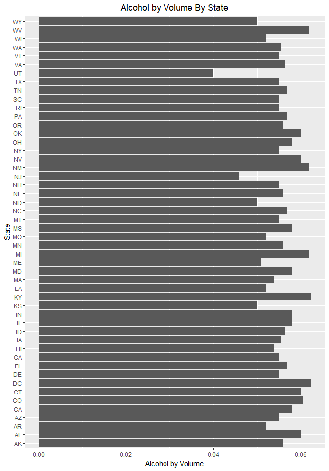
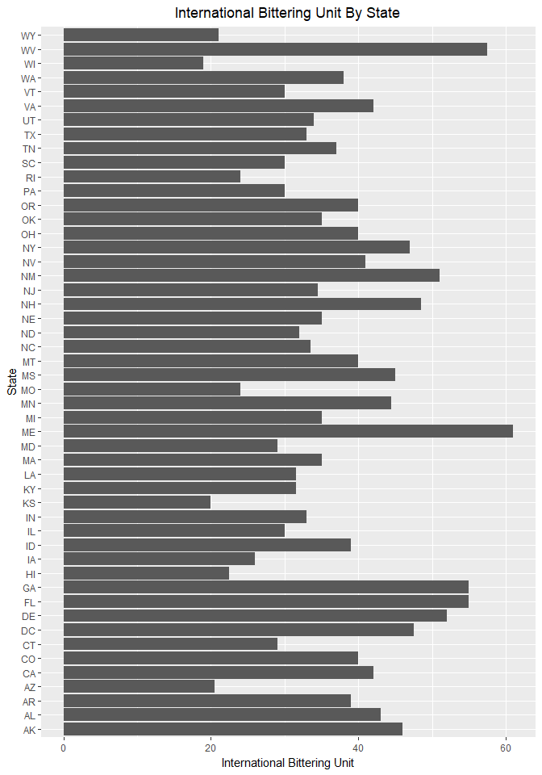

### MSDS 6306: Case Study 1 Introduction
The following document represents a case study of craft breweries and the beers they produce across the United States. In this study we will make some general observations with the hope of providing information concerning details of the craft brewery market in the United States. This study does not represent an exhaustive list of craft breweries and their beers, but does contain general information about the overall craft beer market. Craft breweries are growing across the nation, as we can see in the following table.

Table 1: Contains a total count of the number of breweries by their respective state

```r
# Question 1. How many breweries are present in each state?
# Read the breweries.csv into a dataframe and assign the variable name brew
brew <- read.csv(file = "breweries.csv", header = TRUE, sep = ",", strip.white = TRUE)
# Assign the count function against the State column to the variable name st
st <- count(brew, "State")
states <- map_data("state")
state_names <- data.frame( region = tolower(state.name), state.abb = state.abb)
st <- merge( st, state_names, by.x = "State", by.y = "state.abb" )
choro <- merge(states, st, sort = FALSE, by = "region")
choro <- choro[order(choro$order), ]
ggplot(choro, aes(long, lat)) +
    geom_polygon(aes(group = group, fill = freq)) +
    coord_map("albers",  at0 = 45.5, lat1 = 29.5) +
    labs(title="Number of Breweries by State", x = "", y = "") +
    theme(axis.text.x = element_blank(),
          axis.text.y = element_blank(),
          axis.ticks = element_blank(),
          rect = element_blank(),
          plot.title = element_text(hjust = 0.5))
```

<!-- -->

```r
# Display the st variable output
kable( st,row.names=FALSE )  %>%
  kable_styling(bootstrap_options = c("striped", "condensed"), full_width = F)
```

<table class="table table-striped table-condensed" style="width: auto !important; margin-left: auto; margin-right: auto;">
 <thead>
  <tr>
   <th style="text-align:left;"> State </th>
   <th style="text-align:right;"> freq </th>
   <th style="text-align:left;"> region </th>
  </tr>
 </thead>
<tbody>
  <tr>
   <td style="text-align:left;"> AK </td>
   <td style="text-align:right;"> 7 </td>
   <td style="text-align:left;"> alaska </td>
  </tr>
  <tr>
   <td style="text-align:left;"> AL </td>
   <td style="text-align:right;"> 3 </td>
   <td style="text-align:left;"> alabama </td>
  </tr>
  <tr>
   <td style="text-align:left;"> AR </td>
   <td style="text-align:right;"> 2 </td>
   <td style="text-align:left;"> arkansas </td>
  </tr>
  <tr>
   <td style="text-align:left;"> AZ </td>
   <td style="text-align:right;"> 11 </td>
   <td style="text-align:left;"> arizona </td>
  </tr>
  <tr>
   <td style="text-align:left;"> CA </td>
   <td style="text-align:right;"> 39 </td>
   <td style="text-align:left;"> california </td>
  </tr>
  <tr>
   <td style="text-align:left;"> CO </td>
   <td style="text-align:right;"> 47 </td>
   <td style="text-align:left;"> colorado </td>
  </tr>
  <tr>
   <td style="text-align:left;"> CT </td>
   <td style="text-align:right;"> 8 </td>
   <td style="text-align:left;"> connecticut </td>
  </tr>
  <tr>
   <td style="text-align:left;"> DE </td>
   <td style="text-align:right;"> 2 </td>
   <td style="text-align:left;"> delaware </td>
  </tr>
  <tr>
   <td style="text-align:left;"> FL </td>
   <td style="text-align:right;"> 15 </td>
   <td style="text-align:left;"> florida </td>
  </tr>
  <tr>
   <td style="text-align:left;"> GA </td>
   <td style="text-align:right;"> 7 </td>
   <td style="text-align:left;"> georgia </td>
  </tr>
  <tr>
   <td style="text-align:left;"> HI </td>
   <td style="text-align:right;"> 4 </td>
   <td style="text-align:left;"> hawaii </td>
  </tr>
  <tr>
   <td style="text-align:left;"> IA </td>
   <td style="text-align:right;"> 5 </td>
   <td style="text-align:left;"> iowa </td>
  </tr>
  <tr>
   <td style="text-align:left;"> ID </td>
   <td style="text-align:right;"> 5 </td>
   <td style="text-align:left;"> idaho </td>
  </tr>
  <tr>
   <td style="text-align:left;"> IL </td>
   <td style="text-align:right;"> 18 </td>
   <td style="text-align:left;"> illinois </td>
  </tr>
  <tr>
   <td style="text-align:left;"> IN </td>
   <td style="text-align:right;"> 22 </td>
   <td style="text-align:left;"> indiana </td>
  </tr>
  <tr>
   <td style="text-align:left;"> KS </td>
   <td style="text-align:right;"> 3 </td>
   <td style="text-align:left;"> kansas </td>
  </tr>
  <tr>
   <td style="text-align:left;"> KY </td>
   <td style="text-align:right;"> 4 </td>
   <td style="text-align:left;"> kentucky </td>
  </tr>
  <tr>
   <td style="text-align:left;"> LA </td>
   <td style="text-align:right;"> 5 </td>
   <td style="text-align:left;"> louisiana </td>
  </tr>
  <tr>
   <td style="text-align:left;"> MA </td>
   <td style="text-align:right;"> 23 </td>
   <td style="text-align:left;"> massachusetts </td>
  </tr>
  <tr>
   <td style="text-align:left;"> MD </td>
   <td style="text-align:right;"> 7 </td>
   <td style="text-align:left;"> maryland </td>
  </tr>
  <tr>
   <td style="text-align:left;"> ME </td>
   <td style="text-align:right;"> 9 </td>
   <td style="text-align:left;"> maine </td>
  </tr>
  <tr>
   <td style="text-align:left;"> MI </td>
   <td style="text-align:right;"> 32 </td>
   <td style="text-align:left;"> michigan </td>
  </tr>
  <tr>
   <td style="text-align:left;"> MN </td>
   <td style="text-align:right;"> 12 </td>
   <td style="text-align:left;"> minnesota </td>
  </tr>
  <tr>
   <td style="text-align:left;"> MO </td>
   <td style="text-align:right;"> 9 </td>
   <td style="text-align:left;"> missouri </td>
  </tr>
  <tr>
   <td style="text-align:left;"> MS </td>
   <td style="text-align:right;"> 2 </td>
   <td style="text-align:left;"> mississippi </td>
  </tr>
  <tr>
   <td style="text-align:left;"> MT </td>
   <td style="text-align:right;"> 9 </td>
   <td style="text-align:left;"> montana </td>
  </tr>
  <tr>
   <td style="text-align:left;"> NC </td>
   <td style="text-align:right;"> 19 </td>
   <td style="text-align:left;"> north carolina </td>
  </tr>
  <tr>
   <td style="text-align:left;"> ND </td>
   <td style="text-align:right;"> 1 </td>
   <td style="text-align:left;"> north dakota </td>
  </tr>
  <tr>
   <td style="text-align:left;"> NE </td>
   <td style="text-align:right;"> 5 </td>
   <td style="text-align:left;"> nebraska </td>
  </tr>
  <tr>
   <td style="text-align:left;"> NH </td>
   <td style="text-align:right;"> 3 </td>
   <td style="text-align:left;"> new hampshire </td>
  </tr>
  <tr>
   <td style="text-align:left;"> NJ </td>
   <td style="text-align:right;"> 3 </td>
   <td style="text-align:left;"> new jersey </td>
  </tr>
  <tr>
   <td style="text-align:left;"> NM </td>
   <td style="text-align:right;"> 4 </td>
   <td style="text-align:left;"> new mexico </td>
  </tr>
  <tr>
   <td style="text-align:left;"> NV </td>
   <td style="text-align:right;"> 2 </td>
   <td style="text-align:left;"> nevada </td>
  </tr>
  <tr>
   <td style="text-align:left;"> NY </td>
   <td style="text-align:right;"> 16 </td>
   <td style="text-align:left;"> new york </td>
  </tr>
  <tr>
   <td style="text-align:left;"> OH </td>
   <td style="text-align:right;"> 15 </td>
   <td style="text-align:left;"> ohio </td>
  </tr>
  <tr>
   <td style="text-align:left;"> OK </td>
   <td style="text-align:right;"> 6 </td>
   <td style="text-align:left;"> oklahoma </td>
  </tr>
  <tr>
   <td style="text-align:left;"> OR </td>
   <td style="text-align:right;"> 29 </td>
   <td style="text-align:left;"> oregon </td>
  </tr>
  <tr>
   <td style="text-align:left;"> PA </td>
   <td style="text-align:right;"> 25 </td>
   <td style="text-align:left;"> pennsylvania </td>
  </tr>
  <tr>
   <td style="text-align:left;"> RI </td>
   <td style="text-align:right;"> 5 </td>
   <td style="text-align:left;"> rhode island </td>
  </tr>
  <tr>
   <td style="text-align:left;"> SC </td>
   <td style="text-align:right;"> 4 </td>
   <td style="text-align:left;"> south carolina </td>
  </tr>
  <tr>
   <td style="text-align:left;"> SD </td>
   <td style="text-align:right;"> 1 </td>
   <td style="text-align:left;"> south dakota </td>
  </tr>
  <tr>
   <td style="text-align:left;"> TN </td>
   <td style="text-align:right;"> 3 </td>
   <td style="text-align:left;"> tennessee </td>
  </tr>
  <tr>
   <td style="text-align:left;"> TX </td>
   <td style="text-align:right;"> 28 </td>
   <td style="text-align:left;"> texas </td>
  </tr>
  <tr>
   <td style="text-align:left;"> UT </td>
   <td style="text-align:right;"> 4 </td>
   <td style="text-align:left;"> utah </td>
  </tr>
  <tr>
   <td style="text-align:left;"> VA </td>
   <td style="text-align:right;"> 16 </td>
   <td style="text-align:left;"> virginia </td>
  </tr>
  <tr>
   <td style="text-align:left;"> VT </td>
   <td style="text-align:right;"> 10 </td>
   <td style="text-align:left;"> vermont </td>
  </tr>
  <tr>
   <td style="text-align:left;"> WA </td>
   <td style="text-align:right;"> 23 </td>
   <td style="text-align:left;"> washington </td>
  </tr>
  <tr>
   <td style="text-align:left;"> WI </td>
   <td style="text-align:right;"> 20 </td>
   <td style="text-align:left;"> wisconsin </td>
  </tr>
  <tr>
   <td style="text-align:left;"> WV </td>
   <td style="text-align:right;"> 1 </td>
   <td style="text-align:left;"> west virginia </td>
  </tr>
  <tr>
   <td style="text-align:left;"> WY </td>
   <td style="text-align:right;"> 4 </td>
   <td style="text-align:left;"> wyoming </td>
  </tr>
</tbody>
</table>

There are numerous different types of beer styles. Each style of beer is created using different types of ingredients which include barley, malt, hops, and yeast. This also includes cider and lambic which is made from fruit juice.Some other types of beer include milk stout which uses maltose dextrose which is the ingredient that makes milk sweet and also gives the beer a familiar mouth feel like the creamy texture of milk, but with a kick! See tables 2 and 3 for listings of different beers and the breweries which product them.

Table 2: Lists several different styles of beer and corresponding breweries

```r
# Question 2. Merge beer data with the breweries data. Print the first 6 observations and the last six observations to check the merged file. 
# Read the beers.csv and assign it to the beer variable
beer <- read.csv(file = "beers.csv", header = TRUE, sep = ",", strip.white = TRUE)
# Merge the beers and brew data frames into the brewbeer variable
brewbeer <- merge(brew, beer, by.x = "Brew_ID", by.y="Brewery_id")
# Update Column Names
names(brewbeer) <- c('Brew_ID','Brewery','City','State','Beer','Beer_ID','ABV','IBU','Style','Ounces')
# Display the first 6 lines of the merged dataset
kable( head(brewbeer),row.names=FALSE ) %>%
  kable_styling(bootstrap_options = c("striped", "condensed"))
```

<table class="table table-striped table-condensed" style="margin-left: auto; margin-right: auto;">
 <thead>
  <tr>
   <th style="text-align:right;"> Brew_ID </th>
   <th style="text-align:left;"> Brewery </th>
   <th style="text-align:left;"> City </th>
   <th style="text-align:left;"> State </th>
   <th style="text-align:left;"> Beer </th>
   <th style="text-align:right;"> Beer_ID </th>
   <th style="text-align:right;"> ABV </th>
   <th style="text-align:right;"> IBU </th>
   <th style="text-align:left;"> Style </th>
   <th style="text-align:right;"> Ounces </th>
  </tr>
 </thead>
<tbody>
  <tr>
   <td style="text-align:right;"> 1 </td>
   <td style="text-align:left;"> NorthGate Brewing </td>
   <td style="text-align:left;"> Minneapolis </td>
   <td style="text-align:left;"> MN </td>
   <td style="text-align:left;"> Pumpion </td>
   <td style="text-align:right;"> 2689 </td>
   <td style="text-align:right;"> 0.060 </td>
   <td style="text-align:right;"> 38 </td>
   <td style="text-align:left;"> Pumpkin Ale </td>
   <td style="text-align:right;"> 16 </td>
  </tr>
  <tr>
   <td style="text-align:right;"> 1 </td>
   <td style="text-align:left;"> NorthGate Brewing </td>
   <td style="text-align:left;"> Minneapolis </td>
   <td style="text-align:left;"> MN </td>
   <td style="text-align:left;"> Stronghold </td>
   <td style="text-align:right;"> 2688 </td>
   <td style="text-align:right;"> 0.060 </td>
   <td style="text-align:right;"> 25 </td>
   <td style="text-align:left;"> American Porter </td>
   <td style="text-align:right;"> 16 </td>
  </tr>
  <tr>
   <td style="text-align:right;"> 1 </td>
   <td style="text-align:left;"> NorthGate Brewing </td>
   <td style="text-align:left;"> Minneapolis </td>
   <td style="text-align:left;"> MN </td>
   <td style="text-align:left;"> Parapet ESB </td>
   <td style="text-align:right;"> 2687 </td>
   <td style="text-align:right;"> 0.056 </td>
   <td style="text-align:right;"> 47 </td>
   <td style="text-align:left;"> Extra Special / Strong Bitter (ESB) </td>
   <td style="text-align:right;"> 16 </td>
  </tr>
  <tr>
   <td style="text-align:right;"> 1 </td>
   <td style="text-align:left;"> NorthGate Brewing </td>
   <td style="text-align:left;"> Minneapolis </td>
   <td style="text-align:left;"> MN </td>
   <td style="text-align:left;"> Get Together </td>
   <td style="text-align:right;"> 2692 </td>
   <td style="text-align:right;"> 0.045 </td>
   <td style="text-align:right;"> 50 </td>
   <td style="text-align:left;"> American IPA </td>
   <td style="text-align:right;"> 16 </td>
  </tr>
  <tr>
   <td style="text-align:right;"> 1 </td>
   <td style="text-align:left;"> NorthGate Brewing </td>
   <td style="text-align:left;"> Minneapolis </td>
   <td style="text-align:left;"> MN </td>
   <td style="text-align:left;"> Maggie's Leap </td>
   <td style="text-align:right;"> 2691 </td>
   <td style="text-align:right;"> 0.049 </td>
   <td style="text-align:right;"> 26 </td>
   <td style="text-align:left;"> Milk / Sweet Stout </td>
   <td style="text-align:right;"> 16 </td>
  </tr>
  <tr>
   <td style="text-align:right;"> 1 </td>
   <td style="text-align:left;"> NorthGate Brewing </td>
   <td style="text-align:left;"> Minneapolis </td>
   <td style="text-align:left;"> MN </td>
   <td style="text-align:left;"> Wall's End </td>
   <td style="text-align:right;"> 2690 </td>
   <td style="text-align:right;"> 0.048 </td>
   <td style="text-align:right;"> 19 </td>
   <td style="text-align:left;"> English Brown Ale </td>
   <td style="text-align:right;"> 16 </td>
  </tr>
</tbody>
</table>

Table 3: Lists additional styles of beer and corresponding breweries

```r
# Display the last 6 lines of the merged dataset
kable( tail(brewbeer),row.names=FALSE ) %>%
  kable_styling(bootstrap_options = c("striped", "condensed"))
```

<table class="table table-striped table-condensed" style="margin-left: auto; margin-right: auto;">
 <thead>
  <tr>
   <th style="text-align:right;"> Brew_ID </th>
   <th style="text-align:left;"> Brewery </th>
   <th style="text-align:left;"> City </th>
   <th style="text-align:left;"> State </th>
   <th style="text-align:left;"> Beer </th>
   <th style="text-align:right;"> Beer_ID </th>
   <th style="text-align:right;"> ABV </th>
   <th style="text-align:right;"> IBU </th>
   <th style="text-align:left;"> Style </th>
   <th style="text-align:right;"> Ounces </th>
  </tr>
 </thead>
<tbody>
  <tr>
   <td style="text-align:right;"> 556 </td>
   <td style="text-align:left;"> Ukiah Brewing Company </td>
   <td style="text-align:left;"> Ukiah </td>
   <td style="text-align:left;"> CA </td>
   <td style="text-align:left;"> Pilsner Ukiah </td>
   <td style="text-align:right;"> 98 </td>
   <td style="text-align:right;"> 0.055 </td>
   <td style="text-align:right;"> NA </td>
   <td style="text-align:left;"> German Pilsener </td>
   <td style="text-align:right;"> 12 </td>
  </tr>
  <tr>
   <td style="text-align:right;"> 557 </td>
   <td style="text-align:left;"> Butternuts Beer and Ale </td>
   <td style="text-align:left;"> Garrattsville </td>
   <td style="text-align:left;"> NY </td>
   <td style="text-align:left;"> Porkslap Pale Ale </td>
   <td style="text-align:right;"> 49 </td>
   <td style="text-align:right;"> 0.043 </td>
   <td style="text-align:right;"> NA </td>
   <td style="text-align:left;"> American Pale Ale (APA) </td>
   <td style="text-align:right;"> 12 </td>
  </tr>
  <tr>
   <td style="text-align:right;"> 557 </td>
   <td style="text-align:left;"> Butternuts Beer and Ale </td>
   <td style="text-align:left;"> Garrattsville </td>
   <td style="text-align:left;"> NY </td>
   <td style="text-align:left;"> Snapperhead IPA </td>
   <td style="text-align:right;"> 51 </td>
   <td style="text-align:right;"> 0.068 </td>
   <td style="text-align:right;"> NA </td>
   <td style="text-align:left;"> American IPA </td>
   <td style="text-align:right;"> 12 </td>
  </tr>
  <tr>
   <td style="text-align:right;"> 557 </td>
   <td style="text-align:left;"> Butternuts Beer and Ale </td>
   <td style="text-align:left;"> Garrattsville </td>
   <td style="text-align:left;"> NY </td>
   <td style="text-align:left;"> Moo Thunder Stout </td>
   <td style="text-align:right;"> 50 </td>
   <td style="text-align:right;"> 0.049 </td>
   <td style="text-align:right;"> NA </td>
   <td style="text-align:left;"> Milk / Sweet Stout </td>
   <td style="text-align:right;"> 12 </td>
  </tr>
  <tr>
   <td style="text-align:right;"> 557 </td>
   <td style="text-align:left;"> Butternuts Beer and Ale </td>
   <td style="text-align:left;"> Garrattsville </td>
   <td style="text-align:left;"> NY </td>
   <td style="text-align:left;"> Heinnieweisse Weissebier </td>
   <td style="text-align:right;"> 52 </td>
   <td style="text-align:right;"> 0.049 </td>
   <td style="text-align:right;"> NA </td>
   <td style="text-align:left;"> Hefeweizen </td>
   <td style="text-align:right;"> 12 </td>
  </tr>
  <tr>
   <td style="text-align:right;"> 558 </td>
   <td style="text-align:left;"> Sleeping Lady Brewing Company </td>
   <td style="text-align:left;"> Anchorage </td>
   <td style="text-align:left;"> AK </td>
   <td style="text-align:left;"> Urban Wilderness Pale Ale </td>
   <td style="text-align:right;"> 30 </td>
   <td style="text-align:right;"> 0.049 </td>
   <td style="text-align:right;"> NA </td>
   <td style="text-align:left;"> English Pale Ale </td>
   <td style="text-align:right;"> 12 </td>
  </tr>
</tbody>
</table>

Due to missing values provided in the data used for the analysis we cannot give a true value of the averages to some of the values, but a rough estimate based on the information provided. For transparency we have included the portions of data which are missing. While International Bittering Units (IBU) may not be a real game changer, it could give us a feel for which regional areas prefer a more bitter beer, or possibly have better access to hops with high IBU values based on acidity. The gap in Alcohol By Volume (ABV) is considerably smaller and should have little consequence on the analysis. See table 3 for the exhaustive list of missing values.

Table 4: List of missing values in each column

```r
# Question 3. Report the number of NA's in each column.
# Use sapply to count how many NAs are in each column
dt <- sapply( brewbeer, function(y) sum( length( which( is.na( y ) ) ) ) )
dt <- data.frame( FieldNames = names(brewbeer), Missing_NAs = dt)
kable( dt, row.names=FALSE ) %>%
  kable_styling(bootstrap_options = c("striped", "condensed"))
```

<table class="table table-striped table-condensed" style="margin-left: auto; margin-right: auto;">
 <thead>
  <tr>
   <th style="text-align:left;"> FieldNames </th>
   <th style="text-align:right;"> Missing_NAs </th>
  </tr>
 </thead>
<tbody>
  <tr>
   <td style="text-align:left;"> Brew_ID </td>
   <td style="text-align:right;"> 0 </td>
  </tr>
  <tr>
   <td style="text-align:left;"> Brewery </td>
   <td style="text-align:right;"> 0 </td>
  </tr>
  <tr>
   <td style="text-align:left;"> City </td>
   <td style="text-align:right;"> 0 </td>
  </tr>
  <tr>
   <td style="text-align:left;"> State </td>
   <td style="text-align:right;"> 0 </td>
  </tr>
  <tr>
   <td style="text-align:left;"> Beer </td>
   <td style="text-align:right;"> 0 </td>
  </tr>
  <tr>
   <td style="text-align:left;"> Beer_ID </td>
   <td style="text-align:right;"> 0 </td>
  </tr>
  <tr>
   <td style="text-align:left;"> ABV </td>
   <td style="text-align:right;"> 62 </td>
  </tr>
  <tr>
   <td style="text-align:left;"> IBU </td>
   <td style="text-align:right;"> 1005 </td>
  </tr>
  <tr>
   <td style="text-align:left;"> Style </td>
   <td style="text-align:right;"> 0 </td>
  </tr>
  <tr>
   <td style="text-align:left;"> Ounces </td>
   <td style="text-align:right;"> 0 </td>
  </tr>
</tbody>
</table>

Table 5 lists the average ABV and IBU by state. From this list of values we can see a wide range of values which could help us determine which states prefer milder flavored beers and which are accustomed to a higher alcohol content which is determined by the specific contents of the beer. This could be in relation to regional availability of different raw ingredients. In order to draw a real conclusion on IBU more data would have to be collected.

Table 5: Average ABV and IBU by state

```r
# Question 4. Compute the median alcohol content and international bitterness
# aggregate function to get the median value for ABV and IBU
# we are ignoring any NA values for the purpose of this study.
median_abv_ibu <- aggregate( brewbeer[ , 7:8 ], list( brewbeer$State ), median, na.rm=TRUE )
names(median_abv_ibu) <- c('State','ABV','IBU')
kable( median_abv_ibu, row.names=FALSE  ) %>%
  kable_styling(bootstrap_options = c("striped", "condensed"))
```

<table class="table table-striped table-condensed" style="margin-left: auto; margin-right: auto;">
 <thead>
  <tr>
   <th style="text-align:left;"> State </th>
   <th style="text-align:right;"> ABV </th>
   <th style="text-align:right;"> IBU </th>
  </tr>
 </thead>
<tbody>
  <tr>
   <td style="text-align:left;"> AK </td>
   <td style="text-align:right;"> 0.0560 </td>
   <td style="text-align:right;"> 46.0 </td>
  </tr>
  <tr>
   <td style="text-align:left;"> AL </td>
   <td style="text-align:right;"> 0.0600 </td>
   <td style="text-align:right;"> 43.0 </td>
  </tr>
  <tr>
   <td style="text-align:left;"> AR </td>
   <td style="text-align:right;"> 0.0520 </td>
   <td style="text-align:right;"> 39.0 </td>
  </tr>
  <tr>
   <td style="text-align:left;"> AZ </td>
   <td style="text-align:right;"> 0.0550 </td>
   <td style="text-align:right;"> 20.5 </td>
  </tr>
  <tr>
   <td style="text-align:left;"> CA </td>
   <td style="text-align:right;"> 0.0580 </td>
   <td style="text-align:right;"> 42.0 </td>
  </tr>
  <tr>
   <td style="text-align:left;"> CO </td>
   <td style="text-align:right;"> 0.0605 </td>
   <td style="text-align:right;"> 40.0 </td>
  </tr>
  <tr>
   <td style="text-align:left;"> CT </td>
   <td style="text-align:right;"> 0.0600 </td>
   <td style="text-align:right;"> 29.0 </td>
  </tr>
  <tr>
   <td style="text-align:left;"> DC </td>
   <td style="text-align:right;"> 0.0625 </td>
   <td style="text-align:right;"> 47.5 </td>
  </tr>
  <tr>
   <td style="text-align:left;"> DE </td>
   <td style="text-align:right;"> 0.0550 </td>
   <td style="text-align:right;"> 52.0 </td>
  </tr>
  <tr>
   <td style="text-align:left;"> FL </td>
   <td style="text-align:right;"> 0.0570 </td>
   <td style="text-align:right;"> 55.0 </td>
  </tr>
  <tr>
   <td style="text-align:left;"> GA </td>
   <td style="text-align:right;"> 0.0550 </td>
   <td style="text-align:right;"> 55.0 </td>
  </tr>
  <tr>
   <td style="text-align:left;"> HI </td>
   <td style="text-align:right;"> 0.0540 </td>
   <td style="text-align:right;"> 22.5 </td>
  </tr>
  <tr>
   <td style="text-align:left;"> IA </td>
   <td style="text-align:right;"> 0.0555 </td>
   <td style="text-align:right;"> 26.0 </td>
  </tr>
  <tr>
   <td style="text-align:left;"> ID </td>
   <td style="text-align:right;"> 0.0565 </td>
   <td style="text-align:right;"> 39.0 </td>
  </tr>
  <tr>
   <td style="text-align:left;"> IL </td>
   <td style="text-align:right;"> 0.0580 </td>
   <td style="text-align:right;"> 30.0 </td>
  </tr>
  <tr>
   <td style="text-align:left;"> IN </td>
   <td style="text-align:right;"> 0.0580 </td>
   <td style="text-align:right;"> 33.0 </td>
  </tr>
  <tr>
   <td style="text-align:left;"> KS </td>
   <td style="text-align:right;"> 0.0500 </td>
   <td style="text-align:right;"> 20.0 </td>
  </tr>
  <tr>
   <td style="text-align:left;"> KY </td>
   <td style="text-align:right;"> 0.0625 </td>
   <td style="text-align:right;"> 31.5 </td>
  </tr>
  <tr>
   <td style="text-align:left;"> LA </td>
   <td style="text-align:right;"> 0.0520 </td>
   <td style="text-align:right;"> 31.5 </td>
  </tr>
  <tr>
   <td style="text-align:left;"> MA </td>
   <td style="text-align:right;"> 0.0540 </td>
   <td style="text-align:right;"> 35.0 </td>
  </tr>
  <tr>
   <td style="text-align:left;"> MD </td>
   <td style="text-align:right;"> 0.0580 </td>
   <td style="text-align:right;"> 29.0 </td>
  </tr>
  <tr>
   <td style="text-align:left;"> ME </td>
   <td style="text-align:right;"> 0.0510 </td>
   <td style="text-align:right;"> 61.0 </td>
  </tr>
  <tr>
   <td style="text-align:left;"> MI </td>
   <td style="text-align:right;"> 0.0620 </td>
   <td style="text-align:right;"> 35.0 </td>
  </tr>
  <tr>
   <td style="text-align:left;"> MN </td>
   <td style="text-align:right;"> 0.0560 </td>
   <td style="text-align:right;"> 44.5 </td>
  </tr>
  <tr>
   <td style="text-align:left;"> MO </td>
   <td style="text-align:right;"> 0.0520 </td>
   <td style="text-align:right;"> 24.0 </td>
  </tr>
  <tr>
   <td style="text-align:left;"> MS </td>
   <td style="text-align:right;"> 0.0580 </td>
   <td style="text-align:right;"> 45.0 </td>
  </tr>
  <tr>
   <td style="text-align:left;"> MT </td>
   <td style="text-align:right;"> 0.0550 </td>
   <td style="text-align:right;"> 40.0 </td>
  </tr>
  <tr>
   <td style="text-align:left;"> NC </td>
   <td style="text-align:right;"> 0.0570 </td>
   <td style="text-align:right;"> 33.5 </td>
  </tr>
  <tr>
   <td style="text-align:left;"> ND </td>
   <td style="text-align:right;"> 0.0500 </td>
   <td style="text-align:right;"> 32.0 </td>
  </tr>
  <tr>
   <td style="text-align:left;"> NE </td>
   <td style="text-align:right;"> 0.0560 </td>
   <td style="text-align:right;"> 35.0 </td>
  </tr>
  <tr>
   <td style="text-align:left;"> NH </td>
   <td style="text-align:right;"> 0.0550 </td>
   <td style="text-align:right;"> 48.5 </td>
  </tr>
  <tr>
   <td style="text-align:left;"> NJ </td>
   <td style="text-align:right;"> 0.0460 </td>
   <td style="text-align:right;"> 34.5 </td>
  </tr>
  <tr>
   <td style="text-align:left;"> NM </td>
   <td style="text-align:right;"> 0.0620 </td>
   <td style="text-align:right;"> 51.0 </td>
  </tr>
  <tr>
   <td style="text-align:left;"> NV </td>
   <td style="text-align:right;"> 0.0600 </td>
   <td style="text-align:right;"> 41.0 </td>
  </tr>
  <tr>
   <td style="text-align:left;"> NY </td>
   <td style="text-align:right;"> 0.0550 </td>
   <td style="text-align:right;"> 47.0 </td>
  </tr>
  <tr>
   <td style="text-align:left;"> OH </td>
   <td style="text-align:right;"> 0.0580 </td>
   <td style="text-align:right;"> 40.0 </td>
  </tr>
  <tr>
   <td style="text-align:left;"> OK </td>
   <td style="text-align:right;"> 0.0600 </td>
   <td style="text-align:right;"> 35.0 </td>
  </tr>
  <tr>
   <td style="text-align:left;"> OR </td>
   <td style="text-align:right;"> 0.0560 </td>
   <td style="text-align:right;"> 40.0 </td>
  </tr>
  <tr>
   <td style="text-align:left;"> PA </td>
   <td style="text-align:right;"> 0.0570 </td>
   <td style="text-align:right;"> 30.0 </td>
  </tr>
  <tr>
   <td style="text-align:left;"> RI </td>
   <td style="text-align:right;"> 0.0550 </td>
   <td style="text-align:right;"> 24.0 </td>
  </tr>
  <tr>
   <td style="text-align:left;"> SC </td>
   <td style="text-align:right;"> 0.0550 </td>
   <td style="text-align:right;"> 30.0 </td>
  </tr>
  <tr>
   <td style="text-align:left;"> SD </td>
   <td style="text-align:right;"> 0.0600 </td>
   <td style="text-align:right;"> NA </td>
  </tr>
  <tr>
   <td style="text-align:left;"> TN </td>
   <td style="text-align:right;"> 0.0570 </td>
   <td style="text-align:right;"> 37.0 </td>
  </tr>
  <tr>
   <td style="text-align:left;"> TX </td>
   <td style="text-align:right;"> 0.0550 </td>
   <td style="text-align:right;"> 33.0 </td>
  </tr>
  <tr>
   <td style="text-align:left;"> UT </td>
   <td style="text-align:right;"> 0.0400 </td>
   <td style="text-align:right;"> 34.0 </td>
  </tr>
  <tr>
   <td style="text-align:left;"> VA </td>
   <td style="text-align:right;"> 0.0565 </td>
   <td style="text-align:right;"> 42.0 </td>
  </tr>
  <tr>
   <td style="text-align:left;"> VT </td>
   <td style="text-align:right;"> 0.0550 </td>
   <td style="text-align:right;"> 30.0 </td>
  </tr>
  <tr>
   <td style="text-align:left;"> WA </td>
   <td style="text-align:right;"> 0.0555 </td>
   <td style="text-align:right;"> 38.0 </td>
  </tr>
  <tr>
   <td style="text-align:left;"> WI </td>
   <td style="text-align:right;"> 0.0520 </td>
   <td style="text-align:right;"> 19.0 </td>
  </tr>
  <tr>
   <td style="text-align:left;"> WV </td>
   <td style="text-align:right;"> 0.0620 </td>
   <td style="text-align:right;"> 57.5 </td>
  </tr>
  <tr>
   <td style="text-align:left;"> WY </td>
   <td style="text-align:right;"> 0.0500 </td>
   <td style="text-align:right;"> 21.0 </td>
  </tr>
</tbody>
</table>

The next section of analysis covers ABV. Some states have enacted what are termed "blue laws" which limit the amount of alcohol contained within a beverage, or control the location in which you are able to purchase high proof beverages. To this effect we can see that some states have a much lower alcohol content. Utah which has some of the most strict liquor laws in the United States has the lowest average ABV of 4% or a proof rating of 8. This could be due to a state control, or possibly be related to other holistic cultural differences. Washington DC posts the highest alcohol content with a value of 6.25% or a proof rating of 12.5. See table 5 for details on ABV stats according to state.

Table 6: Median ABV by State

```r
# Add Labels to the plot
ggplot( median_abv_ibu[!is.na(median_abv_ibu$IBU),], aes( State, ABV ) ) +
    geom_bar(stat="identity") +
    labs(title="Alcohol by Volume By State",x ="State", y = "Alcohol by Volume") +
    coord_flip() +
    theme(plot.title = element_text(hjust = 0.5))
```

<!-- -->

Maine comes in with the highest average IBU value in our analysis. Be reminded that our IBU values were not complete. In order to know more about bitterness more data should be collected to have a higher confidence level in the findings. See table 6 for details on IBU by state.

Table 7: Median IBU by State

```r
# Add Labels
ggplot( median_abv_ibu[!is.na(median_abv_ibu$IBU),] , aes( State, IBU ) ) +
    geom_bar(stat="identity") +
    labs(title="International Bittering Unit By State",x ="State", y = "International Bittering Unit") +
    coord_flip() +
    theme(plot.title = element_text(hjust = 0.5))
```

<!-- -->

Colorado has not only the largest amount of breweries in our finding, it also produces the highest ABV rated beer, coming in at a staggering 12.8% alcohol content. That would equate to 25.6 proof, or the same alcohol content of some aperitifs and cordials. Colorado brewing company, Upslope Brewing Company produces this particularly strong beer. See table 7 for specific details concerning this specific beer and its producer.

Table 8: Highest Rated Alcoholic Beer

```r
# Question 5. Which state has the maximum alcoholic (ABV) beer? Which state has the most bitter (IBU) beer? 
# Order by ABV to get the top state
kable( head( brewbeer[order(brewbeer$ABV, decreasing=TRUE),c(4,2,5,7,9) ], 1) ) %>%
  kable_styling(bootstrap_options = c("striped", "condensed"))
```

<table class="table table-striped table-condensed" style="margin-left: auto; margin-right: auto;">
 <thead>
  <tr>
   <th style="text-align:left;">   </th>
   <th style="text-align:left;"> State </th>
   <th style="text-align:left;"> Brewery </th>
   <th style="text-align:left;"> Beer </th>
   <th style="text-align:right;"> ABV </th>
   <th style="text-align:left;"> Style </th>
  </tr>
 </thead>
<tbody>
  <tr>
   <td style="text-align:left;"> 384 </td>
   <td style="text-align:left;"> CO </td>
   <td style="text-align:left;"> Upslope Brewing Company </td>
   <td style="text-align:left;"> Lee Hill Series Vol. 5 - Belgian Style Quadrupel Ale </td>
   <td style="text-align:right;"> 0.128 </td>
   <td style="text-align:left;"> Quadrupel (Quad) </td>
  </tr>
</tbody>
</table>

Oregon has the highest IBU beer, which is an American Double / Imperial IPA. This shouldn't come as a surprise since IPA style beers have the highest concentration of hops of any beer style. Also a very well preserved beer accompanying the sheer bitterness of this brew. This could also be in direct correlation of the availability of cascade hops which are almost solely produced in the state of Washington and within a close proximity to Oregon.

Table 9: Highest Rated Bitterest Beer

```r
# Order by IBU to get the top state
kable( head( brewbeer[order(brewbeer$IBU, decreasing=TRUE),c(4,2,5,8,9) ], 1) ) %>%
  kable_styling(bootstrap_options = c("striped", "condensed"))
```

<table class="table table-striped table-condensed" style="margin-left: auto; margin-right: auto;">
 <thead>
  <tr>
   <th style="text-align:left;">   </th>
   <th style="text-align:left;"> State </th>
   <th style="text-align:left;"> Brewery </th>
   <th style="text-align:left;"> Beer </th>
   <th style="text-align:right;"> IBU </th>
   <th style="text-align:left;"> Style </th>
  </tr>
 </thead>
<tbody>
  <tr>
   <td style="text-align:left;"> 1857 </td>
   <td style="text-align:left;"> OR </td>
   <td style="text-align:left;"> Astoria Brewing Company </td>
   <td style="text-align:left;"> Bitter Bitch Imperial IPA </td>
   <td style="text-align:right;"> 138 </td>
   <td style="text-align:left;"> American Double / Imperial IPA </td>
  </tr>
</tbody>
</table>

Table 10 gives a summary overview of ABV values across the entire United Sate, showing a wide range of alcohol content across the nation. We range from 1/10% to 12.8%. The average value of ABV comes in just below 6% at 5.97% while the absolute center value equates to 5.6%. This stands to reason as there are a larger percentage of lower alcohol content beers with a few high proof beers which are definitely outliers.

Table 10: Summary statistics for the ABV

```r
kable(data.frame(Summary_Statistics_Value = unclass(summary(brewbeer$ABV))))%>%
  kable_styling(bootstrap_options = c("striped", "condensed"), full_width = F)
```

<table class="table table-striped table-condensed" style="width: auto !important; margin-left: auto; margin-right: auto;">
 <thead>
  <tr>
   <th style="text-align:left;">   </th>
   <th style="text-align:right;"> Summary_Statistics_Value </th>
  </tr>
 </thead>
<tbody>
  <tr>
   <td style="text-align:left;"> Min. </td>
   <td style="text-align:right;"> 0.0010000 </td>
  </tr>
  <tr>
   <td style="text-align:left;"> 1st Qu. </td>
   <td style="text-align:right;"> 0.0500000 </td>
  </tr>
  <tr>
   <td style="text-align:left;"> Median </td>
   <td style="text-align:right;"> 0.0560000 </td>
  </tr>
  <tr>
   <td style="text-align:left;"> Mean </td>
   <td style="text-align:right;"> 0.0597734 </td>
  </tr>
  <tr>
   <td style="text-align:left;"> 3rd Qu. </td>
   <td style="text-align:right;"> 0.0670000 </td>
  </tr>
  <tr>
   <td style="text-align:left;"> Max. </td>
   <td style="text-align:right;"> 0.1280000 </td>
  </tr>
  <tr>
   <td style="text-align:left;"> NA's </td>
   <td style="text-align:right;"> 62.0000000 </td>
  </tr>
</tbody>
</table>

For the purpose of this analysis we can conclude less bitter beer typically has a lower alcohol content. This stands to reason considering the highest ABV beers are double and triple, or even quadruple Belgian style ales which contain a larger amount of roasted barley to combat the highly sweet malt content.

Table 11 : Scatter plot of the relationship between bitterness and alcohol yield

```r
#plot(brewbeer$IBU, brewbeer$ABV, main="Scatterplot - Bitterness of the beer Vs Alcoholic content",xlab="International Bitterness Units (IBU)", ylab=" Alcohol By Volume (ABV)", pch=19)
beerAB <- data.frame(brewbeer$IBU, brewbeer$ABV)
sp <- ggplot(brewbeer, aes(x=IBU, y=ABV, color=IBU)) + geom_point()
sp+scale_color_gradient(low="#F0DC82", high="#7B3F00")+labs(subtitle="IBU Vs ABV", 
       y="Alcohol By Volume (ABV)", 
       x="International Bitterness Units (IBU)", 
       title="Scatterplot - Bitterness of the beer Vs Alcoholic content")
```

```
## Warning: Removed 1005 rows containing missing values (geom_point).
```

<!-- -->

In conclusion we recognize there are an immensely diverse versions of beers, styles, and alcohol content. We also understand that different areas of the country are accustomed to higher and lower alcohol content and more or less bitter brews. This could be attributed to raw ingredient availability or even cultural differences. If there was a recommendation on available breweries it would be likely you would find one in the Colorado region since they have the largest amount of breweries and most diverse brewing styles across the nation. It would be the most convenient in its locality to large shipping lanes that traverse the country with many large shipping companies already established. However, the large caveat in purchasing a brewery in Colorado puts you into a market saturated by your largest competitor Miller/Coors.


```r
#makeCodebook(brewbeer)
```
